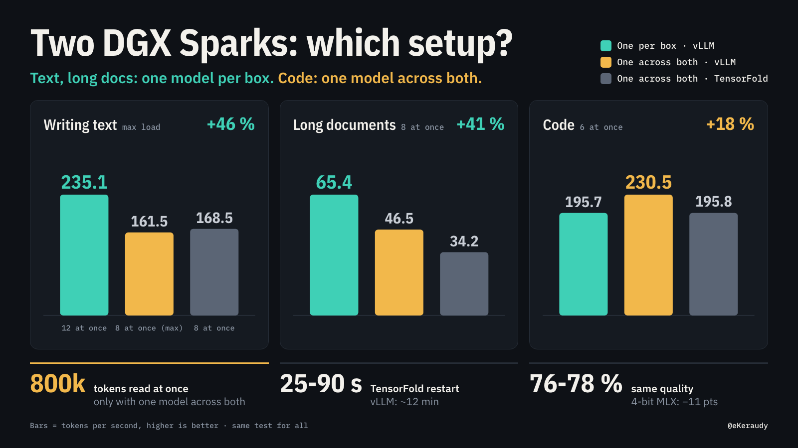

# Two DGX Sparks: which setup?



You have two NVIDIA DGX Sparks on a desk. How do you use them?

Most two-Spark recipes answer one question: *what is the biggest model that fits on two boxes?*
We asked a different question: **with a fixed quality floor, which setup does the most useful work for our mix of jobs?**

We measured four setups on the same bench, with the same model, from 4 to 6 October 2026.
This page gives the numbers, the rule we use to choose, and what we did not measure.

## The short answer

- **Set a quality floor first.** Our floor is an [Artificial Analysis](https://artificialanalysis.ai) Intelligence Index of 40 or more. Without a floor, "more work per second" goes to many small, weak models. That answer is useless.
- **The model sets the quality. The way you run it on the two boxes sets the volume of work.** A bigger model across both boxes gives a few index points (GLM-5.3-Flash: 42; Qwen3.8-Flash-Next: 40). A model that fits on one box, run once on each box, gives about 2× the work per second and 2× the requests at once of one box.
- **For French prose and long documents, one model per box wins** (+46 % on prose at full load, +41 % on long documents at 8 requests at once).
- **For code at 6 requests at once, one model across both boxes wins** (+18 %). It is also the only setup that read an 800,000-token prompt in our tests.
- **Quality stays the same across setups** (76.6 % to 78.4 % on a hard decision set), except the 4-bit MLX checkpoint (about −11 points).
- **TensorFold restarts in 25 s to about 90 s. vLLM needs about 12 minutes.** A fast restart lets one box leave for R&D work and come back without a long stop.

## Words we use

| Word | Meaning |
|---|---|
| Box | One DGX Spark (NVIDIA GB10 chip, 128 GB of memory shared by CPU and GPU). |
| Token | A piece of a word. The model reads and writes tokens. |
| tok/s | Output tokens per second, **for all requests together**. Higher is better. |
| Requests at once | The number of requests that the bench sends at the same time. |
| First token | The time from the request to the first output token. For long prompts, this is mostly the time to read the prompt. |
| One model per box | Each box runs its own full copy of the model. A client or a router sends each request to one box. |
| One model across both | One copy of the model uses the two boxes together, over the cable between them. |
| NVFP4, MLX 4-bit | Two ways to store the model weights in 4 bits. NVFP4 is the NVIDIA format. MLX 4-bit is the only format that TensorFold 0.6.5 reads across two boxes. |
| MTP | Multi-token prediction: the model guesses some next tokens in advance and checks them. It makes output faster. |

## The four setups

```
 (1) One model per box, vLLM            (2) One model across both, vLLM
 +---------+      +---------+           +-------------------------+
 | box 1   |      | box 2   |           | box 1    ====    box 2  |
 | vLLM    |      | vLLM    |           |    one vLLM, one model  |
 | model A |      | model A |           +-------------------------+
 +---------+      +---------+
   requests go to box 1 OR box 2          every request uses both boxes

 (3) One model per box, mixed engines   (4) One model across both, TensorFold
 +---------+      +------------+        +-------------------------+
 | box 1   |      | box 2      |        | box 1    ====    box 2  |
 | vLLM    |      | TensorFold |        | one TensorFold, MLX 4b  |
 | model A |      | model A    |        +-------------------------+
 +---------+      +------------+
```

All four setups use the same model: **Qwen3.8-Flash-Next**. `====` is one 200 Gb/s ConnectX-7 QSFP cable (0.4 m) between the two boxes.

| Setup | Engine and recipe | Weights | Requests at once (limit) |
|---|---|---|---|
| (1) One model per box, vLLM | vLLM, [MiaAI-Lab single-Spark recipe](https://github.com/MiaAI-Lab/Qwen3.8-Flash-Next-Single-DGX-Spark) `b843911`, on each box | NVFP4 | 12 (6 per box, our setting) |
| (2) One model across both, vLLM | vLLM, [MiaAI-Lab dual-Spark recipe](https://github.com/MiaAI-Lab/Qwen3.8-Flash-Next-Dual-DGX-Sparks) `cd839d0`, recipe defaults | NVFP4 (`Mia-AiLab/Qwen3.8-Flash-Next-NVFP4`) | 8 (recipe default `MAX_NUM_SEQS=8`) |
| (3) One model per box, mixed | vLLM single-Spark recipe on box 1, [TensorFold](https://github.com/ashhart/TensorFold) 0.6.5 on box 2 | NVFP4 on both | 6 + 5 |
| (4) One model across both, TensorFold | TensorFold 0.6.5, `--tp 2 --parallel 8` | MLX 4-bit (`Vontra/Qwen3.8-Flash-Next-MLX-4bit-MTP`) | 8 |

We run setup (3) today. We did not measure it as a pair: we measured each half alone (see "What we did not measure").

## How we measured

- **Same bench for all setups**: [`bench/banc_matrice.py`](bench/banc_matrice.py).
- **Three tasks**: French prose (a 300-word argued paragraph), English prose (the same request in English), and English code (a Python module with tests). The prompt texts are in the script.
- **Three prompt lengths**: short (41 to 61 tokens), "16k" (about 20,300 tokens) and "64k" (about 80,600 tokens). Long prompts start with a random line, so no setup can reuse a cached prompt. This is the worst case.
- **Settings**: reasoning off, at most 450 output tokens, temperature 0.7.
- **Each cell**: 10 repetitions. We give the **median of 10** of the total tok/s. The full data has the minimum, the maximum and the first-token times: [`data/results.csv`](data/results.csv).
- **Quality**: the public files of [JevBench](https://github.com/fstandhartinger/jevbench) (231 one-token decisions; the "hard" file has 111). We read the answer from the token probabilities ([`bench/decisions/`](bench/decisions/)).

## Results by type of work

In all tables: total tok/s, median of 10 repetitions. "—" means not measured or above the setup limit. The two last columns are one box alone: they are the two halves of setup (3).

### Writing text (French prose, short prompts)

| Requests at once | (1) One per box, vLLM | (2) Across both, vLLM | (4) Across both, TensorFold | One box, vLLM | One box, TensorFold |
|---|---|---|---|---|---|
| 1 | 37.1 | 36.6 | **52.5** | 37.0 | 31.6 |
| 4 | **119.2** | 102.3 | 115.1 | 97.4 | 82.5 |
| 6 | **155.3** | 131.4 | 133.0 | 119.0 | 70.3 |
| 8 | **188.8** | 161.5 | 168.5 | 98.5 | 84.2 |
| 12 | **235.1** | — (limit 8) | — | — | — |

- At full load, one model per box gives **235.1 tok/s at 12 requests**, against **161.5 at 8 requests** (the limit of setup 2): **+46 %**.
- At the same 8 requests, the gap is smaller: 188.8 against 161.5 (+17 %).
- One box alone stops at 119.0 tok/s (6 requests). One model per box gives 235.1, about 2× that.
- For one request alone, TensorFold across both boxes is the fastest (52.5 tok/s), but it uses the 4-bit MLX weights (see Quality).

### Writing text (English prose, short prompts)

| Requests at once | (1) One per box, vLLM | (2) Across both, vLLM | (4) Across both, TensorFold | One box, vLLM | One box, TensorFold |
|---|---|---|---|---|---|
| 1 | 28.2 | 41.9 | **53.8** | 31.4 | 30.7 |
| 4 | 93.6 | **116.1** | 114.4 | 78.9 | 80.7 |
| 6 | 116.7 | **150.7** | 147.6 | 96.7 | 74.9 |
| 8 | 141.8 | **179.5** | 169.5 | 81.4 | 82.6 |
| 12 | **190.7** | — (limit 8) | — | — | — |

**In English, the result is different.** Setup (2) wins up to 8 requests. Two causes can explain part of this, and we did not separate them:

1. Our single-box vLLM uses a draft vocabulary for MTP that we built from our own outputs, which are mostly French. The dual-box recipe uses its default English-and-code vocabulary. On one box, English prose is slower than French prose (31.4 against 37.0 tok/s for one request).
2. The English run of setup (1) started at 08:03 EDT on a work day. Box 1 also served live traffic. The 1-request cell has a wide range (11.7 to 31.2 tok/s).

For reference, MiaAI-Lab reports 56.8 tok/s for one prose request with the dual-box recipe. We measured 41.9 in English.

### Long documents (about 20,300-token prompts)

| Requests at once | (1) One per box, vLLM | (2) Across both, vLLM | (4) Across both, TensorFold | One box, vLLM | One box, TensorFold |
|---|---|---|---|---|---|
| 1 | 20.9 | 25.1 | **27.7** | 21.2 | 17.6 |
| 4 | **54.1** | 42.3 | 32.4 | 33.3 | 24.6 |
| 6 | **60.8** | 45.5 | 33.5 | 34.9 | 23.8 |
| 8 | **65.4** | 46.5 | 34.2 | 33.4 | 24.9 |
| 12 | **69.9** | — | — | — | — |

French prose. Median time to first token at 8 requests: 22.9 s (1), 34.6 s (2), 70.8 s (4), 41.3 s (one box vLLM), 62.6 s (one box TensorFold).

- At 8 requests, one model per box gives **65.4 tok/s against 46.5: +41 %**.
- Code with the same long prompt shows the same order at 8 requests: 69.5 (1), 49.5 (2), 36.2 (4).
- TensorFold reads long prompts more slowly than vLLM. On one box, the first token comes 1.42× to 1.52× later ([TensorFold #447](https://github.com/ashhart/TensorFold/issues/447)).

**About 80,600-token prompts** (French prose, 8 requests at once): 15.0 tok/s (2), 10.5 (4), 10.8 (one box vLLM), 7.5 (one box TensorFold). We did not measure setup (1) at this length. One box alone could not hold 8 code prompts of this length at once: the memory guard stopped the engine.

### Code (short prompts)

| Requests at once | (1) One per box, vLLM | (2) Across both, vLLM | (4) Across both, TensorFold | One box, vLLM | One box, TensorFold |
|---|---|---|---|---|---|
| 1 | 48.3 | 65.9 | **66.0** | 47.8 | 47.2 |
| 4 | 151.5 | **181.2** | 166.9 | 120.0 | 126.4 |
| 6 | 195.7 | **230.5** | 195.8 | 142.8 | 108.7 |
| 8 | 235.7 | **279.3** | 226.1 | 123.4 | 125.8 |
| 12 | **289.5** | — (limit 8) | — | — | — |

- At 6 requests, one model across both boxes gives **230.5 tok/s against 195.7: +18 %**. At 8 requests: 279.3 against 235.7.
- For one request, the two "across both" setups are about 37 % faster than one box (65.9 and 66.0 against 47.8).
- At 12 requests, one model per box gives 289.5 tok/s. This is a little more than setup (2) at its limit of 8 (279.3).

### One-token decisions

Each decision gives one output token. We read the answer from the token probabilities.

| Setup | Hard file, correct (95 % interval) | Latency p50 / p95 | With ~16k unrelated tokens first: correct | p50 / p95 |
|---|---|---|---|---|
| (2) Across both, vLLM | 76.6 % (67.9-83.5) | 0.27 / 1.07 s | 76.6 % | **6.88 / 8.05 s** |
| One box, vLLM | 78.4 % (69.8-85.0) | 0.34 / 1.31 s | 74.8 % | 9.34 / 10.35 s |
| One box, TensorFold | 78.4 % (69.8-85.0) | 0.28 / 1.76 s | 75.7 % | 12.89 / 14.52 s |

- For decisions after a long text, setup (2) is the fastest, with no loss of correct answers.
- TensorFold on one box has a limit for many short decisions at once. With a shared 540-token start of prompt, it gives 5.27 requests/s at 2 at once, but only 2.12 at 3 at once: the prompt cache stops matching ([TensorFold #459](https://github.com/ashhart/TensorFold/issues/459)). Thus, for many short decisions, send at most 2 at once to TensorFold on one box.

### Very long prompts (more than 262,144 tokens)

The model reads 262,144 tokens natively. Setup (2), with the recipe option YaRN ×4 (context limit 1,048,576 tokens), found a hidden 6-digit code in **9 of 9** tests: at 200k, 500k and 800k tokens, at 10 %, 50 % and 90 % depth. One 800k-token prompt took 504 to 515 s ([`data/needle.csv`](data/needle.csv)).

TensorFold 0.6.5 on CUDA stops at the native 262,144 tokens ([TensorFold #448](https://github.com/ashhart/TensorFold/issues/448)). We did not test YaRN with vLLM on one box.

### Restart time

| Setup | Time to first answer |
|---|---|
| vLLM across both boxes | 705 s (787 s with YaRN) |
| vLLM on one box | about 12 min after an automatic restart |
| TensorFold across both boxes | 38 s cold, 25 s warm restart |
| TensorFold on one box | 90 s and 94 s |

This is why we run setup (3). When the R&D team needs box 2, we stop TensorFold there. When they give the box back, TensorFold answers again in about 90 s. Box 1 serves requests all the time.

### Quality

- On the hard decision file, the setups we measured give 76.6 % to 78.4 % correct. The 95 % intervals overlap almost fully. We read this as the same quality.
- The 4-bit MLX weights (the only weights that TensorFold 0.6.5 reads across two boxes) gave about 11 points less on the same hard file. We measured this separately on 4 October, outside this bench. Across two boxes, the decision bench could not run on that setup (each request returned HTTP 400).

Quality data: [`data/decisions.csv`](data/decisions.csv).

## How to choose

1. **Set the quality floor.** Choose the model first (here: Artificial Analysis Index of 40 or more). The setup does not change quality, except for 4-bit weights.
2. **If your work is mostly prose or long documents, with many users at once**: use one model per box (1).
3. **If your work is mostly code at 4 to 8 requests at once, or decisions after long texts**: use one model across both boxes with vLLM (2).
4. **If you need prompts of more than 262,144 tokens**: use (2) with YaRN. It is the only setup that we tested at 800k tokens.
5. **If one box must often leave for other work**: use one model per box, (1) or (3). The other box continues to serve requests. With TensorFold on the box that leaves (3), it comes back in about 90 s instead of about 12 min.
6. **If you send one request at a time and can accept the 4-bit quality loss**: TensorFold across both boxes (4) is the fastest for one request.

Our mix is French and English prose, code, one-token decisions and long prompts. For this mix, we chose (3): vLLM on box 1, TensorFold on box 2, with a simple rule-based router in front. Prompts of more than about 4,000 tokens, logprobs, images and reasoning go to box 1. Other requests go to the box with less load.

## What we did not measure

- **Setup (3) as a pair.** We measured each half alone (vLLM on one box, TensorFold on one box). We did not measure the two halves behind the router.
- **Setup (1) with a real router.** The client sent request k to box k mod 2: a perfect alternation. A gateway router in "least busy" mode did not spread our streamed requests, so we did not use those numbers. A real router can do less well.
- **Live traffic.** The single-box vLLM was our production engine. The bench ran at the lowest priority, and live requests went first. Box 1 also served live traffic during the setup (1) runs.
- **Setup (1) with 80k-token prompts**, and code at 12 requests with 20k-token prompts.
- **Contexts above 262,144 tokens on one box**, or with TensorFold. We tested them only with vLLM across both boxes.
- **One model only** (Qwen3.8-Flash-Next), one hardware pair, one cable, two engine versions. Other models can give a different order.
- **Reasoning on.** All throughput runs have reasoning off.
- **Different draft vocabularies.** Our single-box vLLM and the dual-box recipe use different MTP vocabularies (see English prose). This changes the speed per language.
- **Quality of setup (1) and setup (4) on our decision bench.** Setup (1) uses the same engine and weights as one box vLLM, so we expect the same quality. We did not measure it.
- **The 4-bit MLX quality loss across two boxes.** The −11 points come from one box.
- **The cause of the TensorFold prompt-cache miss at 3 requests at once** (#459). We also did not measure the same test on vLLM.

## How to reproduce

The scripts use only the Python standard library. Details: [`bench/README.md`](bench/README.md).

1. Start one setup with its recipe (links in "The four setups").
2. Build the long-prompt text: `bench/get_context.sh` (it downloads the public README and CHANGELOG of the dual-box recipe at `cd839d0`).
3. Run the throughput bench:
   `python3 bench/banc_matrice.py <label> http://<host>:<port>/v1/chat/completions <model> 10`
4. For one model per box, add `--urls http://<box1>:<port>/v1/chat/completions,http://<box2>:<port>/v1/chat/completions`.
5. For the decision bench, see [`bench/decisions/`](bench/decisions/). For very long prompts, run `bench/needle.py`.

## Coming next: a setup calculator

A small web page will take your mix of work (prose, code, decisions, prompt sizes, requests at once, how often a box must leave) and recommend a setup, with the expected tok/s and the reason.

## Related work

To our knowledge, on 6 October 2026, no publication measures on the same bench: one model across both boxes with vLLM, one model per box behind a router, a mixed vLLM + TensorFold pair, and TensorFold across both boxes, by type of work, with quality, restart time and R&D use. These works helped us:

- Unsloth, [PR #10280](https://github.com/unslothai/unsloth/pull/10280): llama.cpp, layers across two Sparks against two copies, 1 to 32 users.
- [jszzr/dgx-spark-advisor](https://github.com/jszzr/dgx-spark-advisor): an advisor for two-Spark layouts, from simulation.
- [bytebunkerlabs/dgx-spark-setup](https://github.com/bytebunkerlabs/dgx-spark-setup): vLLM and LiteLLM on two Sparks.
- [TensorFold #167](https://github.com/ashhart/TensorFold/issues/167): TensorFold against vLLM on two Sparks, 1 to 4 streams.
- A setup gist by aussielunix: a two-Spark cluster, 256 to 131k tokens, 1 to 6 streams.
- [The DGX Spark handbook](https://huggingface.co/blog/exolabs/the-dgx-spark-handbook) by exolabs on Hugging Face.

## Issues we filed

- [TensorFold #447](https://github.com/ashhart/TensorFold/issues/447): reading long prompts is about 1.4× to 1.5× slower than vLLM on the same NVFP4 weights.
- [TensorFold #448](https://github.com/ashhart/TensorFold/issues/448): YaRN above the native 262,144 tokens.
- [TensorFold #449](https://github.com/ashhart/TensorFold/issues/449): logprobs with reasoning on, with a reference implementation.
- [TensorFold #459](https://github.com/ashhart/TensorFold/issues/459): the prompt cache stops matching at 3 or more requests at once.
- [Comment on TensorFold #234](https://github.com/ashhart/TensorFold/issues/234#issuecomment-6025041325): why `--vision` refuses the NVFP4 checkpoint.

## Thanks

- **Mia ([MiaAI-Lab](https://github.com/MiaAI-Lab))** for the single-box and dual-box vLLM recipes. All our vLLM numbers start from them.
- **ash ([ashhart](https://github.com/ashhart)) and the TensorFold contributors** for an engine that restarts in seconds.
- The Qwen team for the model, the vLLM project, Vontra for the MLX 4-bit weights, the JevBench authors for a public decision bench, and Artificial Analysis for the quality index.

## License

Code in `bench/`: MIT (see [LICENSE](LICENSE)). Data in `data/` and images in `assets/`: [CC BY 4.0](https://creativecommons.org/licenses/by/4.0/).
